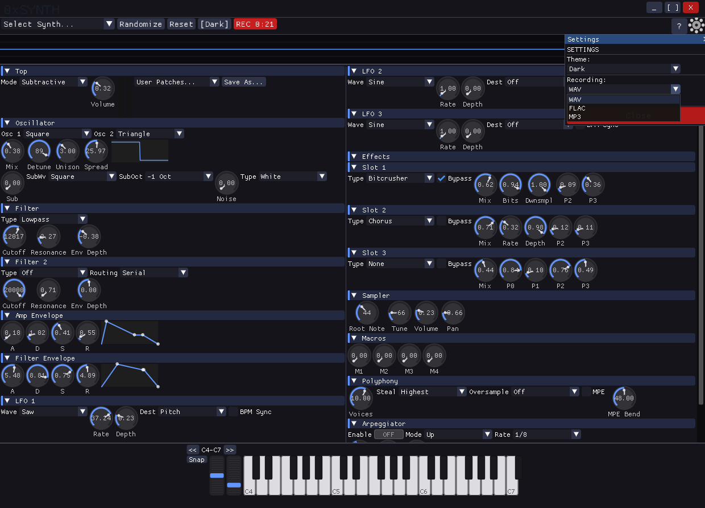
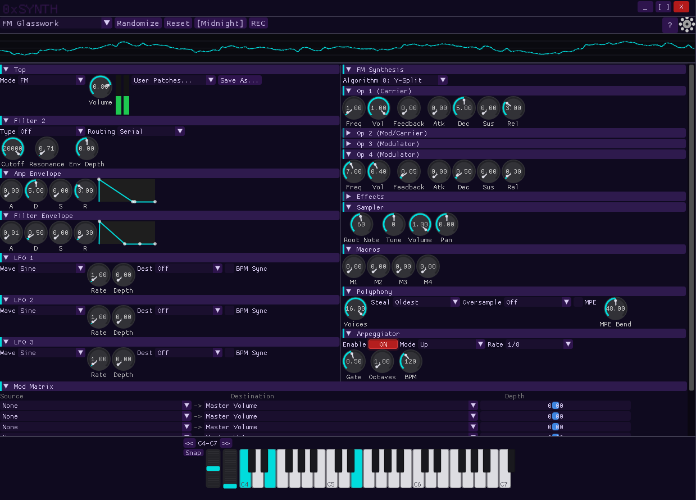
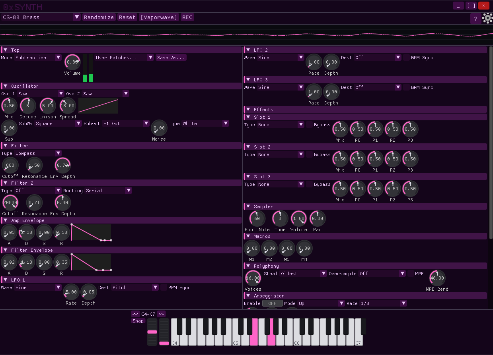
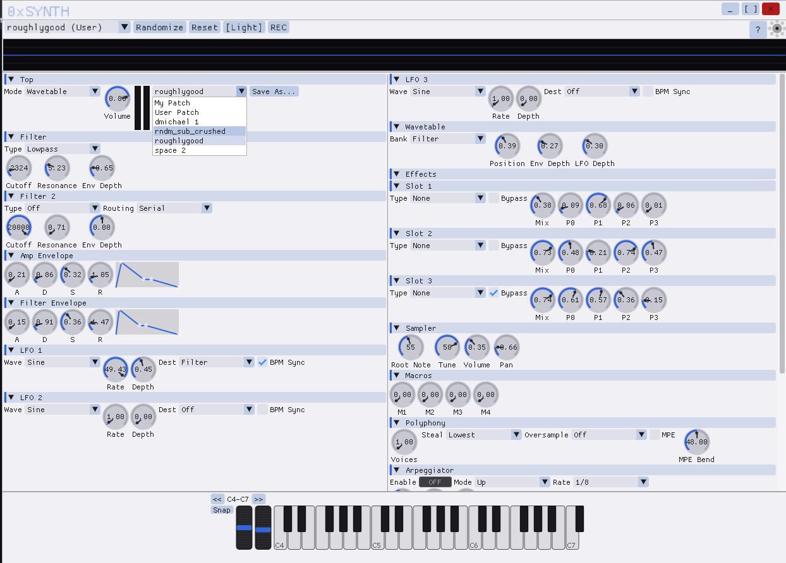
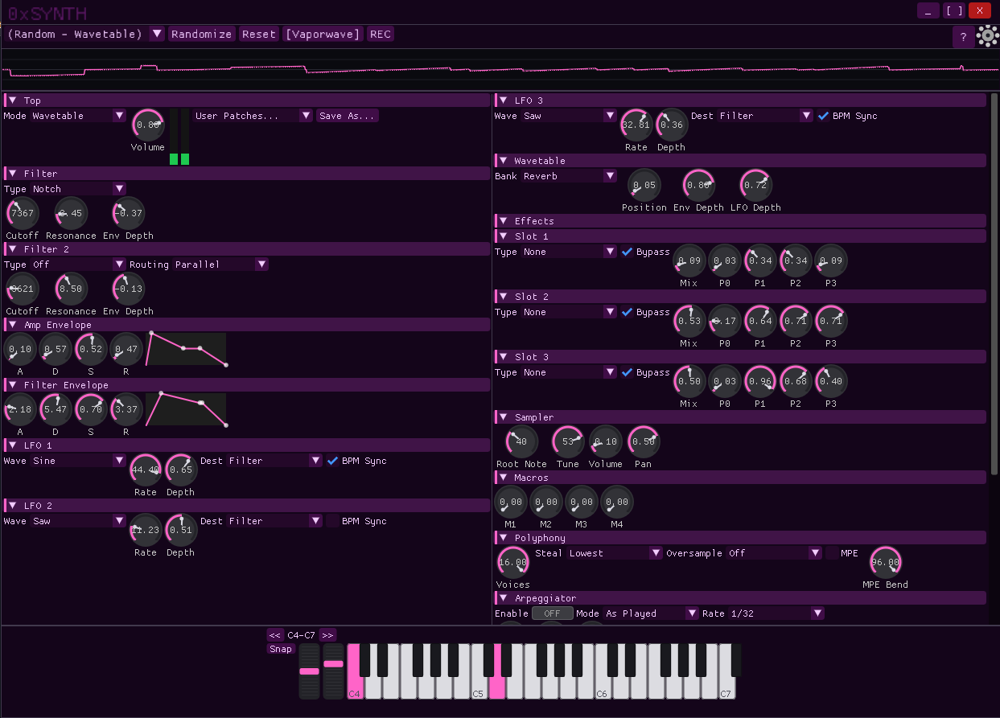

# 0xSYNTH

Multi-engine synthesizer with subtractive, FM, wavetable, and sampler engines. Ships as **CLAP plugin**, **VST3 plugin**, and **standalone app** with ImGui GUI. Pure C engine (C99/C11), real-time safe, cross-platform.

<p align="center">
  <a href="screenshots/dark-recording-settings.png"></a>
  <a href="screenshots/midnight-fm.png"></a>
  <a href="screenshots/vaporwave-subtractive.png"></a>
</p>
<p align="center">
  <a href="screenshots/light-user-presets.png"></a>
  <a href="screenshots/vaporwave-wavetable.png"></a>
</p>

## Download

**[Latest Release](https://github.com/averagenative/0xSYNTH/releases/latest)** — Windows installer/zip, Linux tar.gz/AppImage, macOS DMG/zip

## Features

- **4 synthesis engines** — Subtractive (dual osc, sub, noise, unison), FM (4-op, 8 algorithms), Wavetable (4 banks + import), Sampler
- **7 filter types** — LP, HP, BP, Notch, Ladder 24dB, Comb, Formant — dual filters with serial/parallel routing
- **Modulation matrix** — 8 slots, 16 sources (3 LFOs, envelopes, mod wheel, velocity, aftertouch, macros, MPE)
- **15 effects** — Delay, Reverb, Chorus, Phaser, Flanger, Distortion, Bitcrusher, Compressor, and more
- **Recording** — WAV/FLAC/MP3 with timestamped filenames
- **70 factory presets** — across bass, lead, pad, keys, FX categories
- **7 themes** — Dark, Hacker, Midnight, Amber, Vaporwave, Neon, Light
- **Real-time oscilloscope** — pinned waveform display
- **Arpeggiator** — 5 modes, rate sync, gate control, 1-4 octave range
- **MPE support** — per-note pitch bend, pressure, slide
- **2x/4x oversampling** — reduces aliasing in oscillators

See [FEATURES.md](FEATURES.md) for the complete feature list.

## Build

```bash
# Linux (requires SDL2)
sudo apt install libsdl2-dev
mkdir build && cd build && cmake .. && make -j$(nproc) && ctest

# Windows cross-compile (MinGW from WSL)
cmake -B build-win64 -DCMAKE_TOOLCHAIN_FILE=cmake/mingw-w64-gui.cmake
cmake --build build-win64 --target oxs_standalone oxs_clap oxs_vst3 -j$(nproc)
```

## Plugin Installation

| Format | Windows | macOS | Linux |
|--------|---------|-------|-------|
| CLAP | `C:\Program Files\Common Files\CLAP\` | `~/Library/Audio/Plug-Ins/CLAP/` | `~/.clap/` |
| VST3 | `C:\Program Files\Common Files\VST3\` | `~/Library/Audio/Plug-Ins/VST3/` | `~/.vst3/` |

## Architecture

```
synth_api.h (public API — opaque handle)
    ├── Atomic params (continuous knobs)
    ├── Command queue (note on/off, preset load)
    ├── Output events (peaks, voice activity)
    └── Mod matrix (8 slots, per-voice evaluation)

Engine internals (private):
    oscillator → filter → filter2 → envelope → 3x LFO → voice manager → effects → master
```

All consumers (ImGui GUI, CLAP/VST3 plugin, standalone) interact exclusively through `synth_api.h`. Thread-safe by design — atomic params, lock-free SPSC queues, zero allocations in audio path.

## License

MIT License — see [LICENSE](LICENSE)
